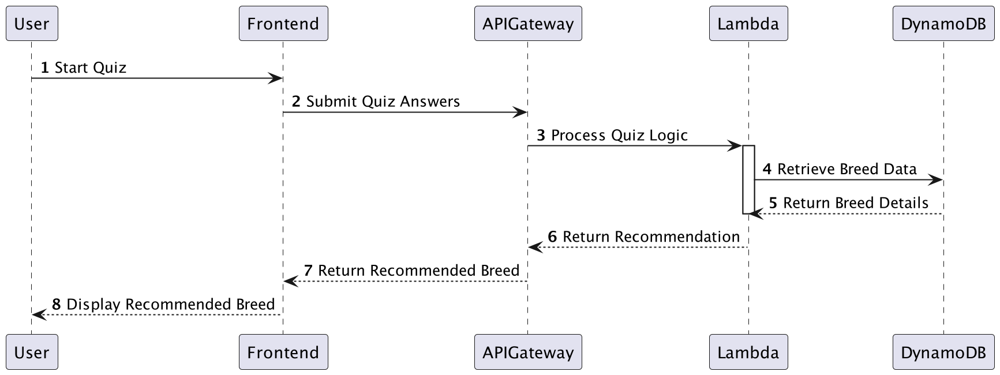

# Raphael Rathle Design Document

## Instructions

*Save a copy of this template for your team in the same folder that contains
this template.*

*Replace italicized text (including this text!) with details of the design you
are proposing for your team project. (Your replacement text shouldn't be in
italics)*

*You should take a look at the example design document in the same folder as
this template for more guidance on the types of information to capture, and the
level of detail to aim for.*

## *Project Title* Design

## 1. Problem Statement

Streamlining the process of finding the perfect dog breed for your lifestyle.
The United States is a nation of dog lovers, with 65.1 million households owning at least one dog, making up 44% of all households. The demand for dogs is substantial, with 34% of dogs coming from breeders and 23% from shelters or rescues, contributing to a thriving dog breeder industry valued at $3.1 billion annually. Despite this, the process of finding the right dog breed for one's lifestyle, and connecting with reputable breeders, rescue groups, or breed-specific kennels, remains fragmented and inefficient.

Potential dog owners often face challenges in identifying the right breed to suit their needs, lifestyle, and preferences. Misalignment between a dog's characteristics and an owner’s expectations can lead to problems such as inadequate care, behavioral issues, or rehoming. Additionally, navigating the vast network of breeders, kennels, and rescue organizations can be overwhelming, often requiring significant time and research to ensure ethical practices and proper breed information.

To address these challenges, this project aims to develop a backend Java program that utilizes the AWS API to streamline the buyer-to-breeder/rescue connection process. The program will feature:

1. A quiz designed to match prospective owners with suitable dog breeds based on their lifestyle, living conditions, and preferences.
2. Direct connections to breed-specific kennel clubs, providing detailed information on each breed and curated lists of reputable breeders and rescue organizations.
3. An efficient and centralized system that promotes informed decision-making, ethical breeding practices, and improved outcomes for both dogs and owners.

By leveraging AWS's robust infrastructure and API capabilities, the program will provide a seamless, data-driven solution to connect dog buyers with reputable sources. This will not only save time and effort for potential owners but also ensure that dogs are placed in homes that match their needs, fostering better long-term relationships between owners and their pets.


## 2. Top Questions to Resolve in Review

*List the most important questions you have about your design, or things that
you are still debating internally that you might like help working through.*

1. should the customer updating their quiz results, be a PATCH to save on API resources, or is it easier to use a PUT request as we are just modifying the quiz. 
2. should customer identification be saved as a personal ID that is automatically created once they take the quiz??
3.  

## 3. Use Cases

*This is where we work backwards from the customer and define what our customers
would like to do (and why). You may also include use cases for yourselves, or
for the organization providing the product to customers.*

U1. As a customer, I want to find out what dog breed fits my lifestyle when I complete my quiz.

U2. As a customer, I want to be linked to the recommended breeds kennel club for information on breed, breeders, and rescues.
    
U3. As a customer, I want to update my previous quiz results to view another dog breed.

## 4. Project Scope

*Clarify which parts of the problem you intend to solve. It helps reviewers know
what questions to ask to make sure you are solving for what you say and stops
discussions from getting sidetracked by aspects you do not intend to handle in
your design.*

### 4.1. In Scope

Recommending dog breed, to person, linking them to kennel club based on results, 

Updating their quiz results 

### 4.2. Out of Scope

* expand to more dog breeds
* scrub data from kennel club info to retrieve breeders list
* scrub data from kennel club info to retrieve rescue groups
* scrub data from kennel club info to gain info on breed without sending user to website
* link to local breeders through data scrubbed 
* If person taking the quiz inputs their email and location, this data could be sent to local breeders, and rescue groups to allow them to reach out to the users.

# 5. Proposed Architecture Overview

*Describe broadly how you are proposing to solve for the requirements you
described in Section 3.*

The user will take a quiz that will determine the breed of recommended for their lifestyle. The data from the quiz will be saved in AWS API attatched to a user unique ID. The website info for the breeds kennel club for the breed will be preloaded in an AWS DynoDBtable.

We will use API Gateway and Lambda to create three endpoints (PostRecomendedDogBreed, GetBreedSpecificWebsite, PatchQuizResults) that will handle the creation, update, and retrieval of user quiz results to satisfy our requirements.

User -> Frontend Quiz Page -> API Gateway -> Lambda (Quiz Logic) -> DynamoDB -> Lambda -> API Gateway -> Frontend -> User


*This may include class diagram(s) showing what components you are planning to
build.*

*You should argue why this architecture (organization of components) is
reasonable. That is, why it represents a good data flow and a good separation of
concerns. Where applicable, argue why this architecture satisfies the stated
requirements.*

# 6. API

## 6.1. Public Models

```
//DogBreedModel 
Purpose; stores static data baout each dog breed 

String Dogbreed;
String customerId;
Integer songCount;
List<String> tags;
```

```
// UserQuizResults
purpose: stores dynamic data from each users quiz results 

String customerID;
Map quizResults;
String recommendedBreed;
Stroing timeStampl 
```

*Define the data models your service will expose in its responses via your
*`-Model`* package. These will be equivalent to the *`PlaylistModel`* and
*`SongModel`* from the Unit 3 project.*

## 6.2. *First Endpoint: PostRecommendedDogBreed*

* Description: Accepts quiz answers, calculates recommended breed, and saves the result.
* Post Http
* Input: user quiz results
* Output: Recommended dog breed and its kennel club link.
*  Failure Cases:
   * If quiz answers are invalid or missing, return 400 Bad Request.
   * If breed information cannot be retrieved, return 500 Internal Server Error.

*Describe the behavior of the first endpoint you will build into your service
API. This should include what data it requires, what data it returns, and how it
will handle any known failure cases. You should also include a sequence diagram
showing how a user interaction goes from user to website to service to database,
and back. This first endpoint can serve as a template for subsequent endpoints.
(If there is a significant difference on a subsequent endpoint, review that with
your team before building it!)*

*(You should have a separate section for each of the endpoints you are expecting
to build...)*

## 6.3 *Second Endpoint* GetDogBreedReccommended
* Endpoint 2: GetDogBreedRecommended
* Purpose: Fetches detailed information about the recommended breed.
* HTTP Method: GET
* URL: /breed/{dogBreed}
* Input: Breed name as a path parameter.
* Output: Dog breed details (e.g., size, energy, traits, kennel club link).
* Failure Cases:
* If the breed is not found, return 404 Not Found.

*(repeat, but you can use shorthand here, indicating what is different, likely
primarily the data in/out and error conditions. If the sequence diagram is
nearly identical, you can say in a few words how it is the same/different from
the first endpoint)*

## 6.3 * Third Endpoint* UpdateDogQuizResults
* Purpose: Allows a user to update their quiz results and view a new recommendation.
* HTTP Method: PATCH
* URL: /quiz-results
* Input: Updated quiz answers.
* Output: Updated recommended breed and its details.
* Failure Cases:
* If the customer ID or quiz results are invalid, return 400 Bad Request.
* If the customer ID is not found, return 404 Not Found.

# 7. Tables

7.1. DogBreeds
```
dogBreed // partition key, string
size // string
energy// string
traits // StringSet
kennel_club_link // String

```
7.2 UserQuizResults
```
UserQuizResults
customerId// partition key, string
quizAnswers// map
Recommendedbreed// String
timeStamp// String 

```
*Define the DynamoDB tables you will need for the data your service will use. It
may be helpful to first think of what objects your service will need, then
translate that to a table structure, like with the *`Playlist` POJO* versus the
`playlists` table in the Unit 3 project.*

# 8. Pages

*Include mock-ups of the web pages you expect to build. These can be as
sophisticated as mockups/wireframes using drawing software, or as simple as
hand-drawn pictures that represent the key customer-facing components of the
pages. It should be clear what the interactions will be on the page, especially
where customers enter and submit data. You may want to accompany the mockups
with some description of behaviors of the page (e.g. “When customer submits the
submit-dog-photo button, the customer is sent to the doggie detail page”)*

[IMG_1534.pdf](..%2FdogDocs%2FIMG_1534.pdf)